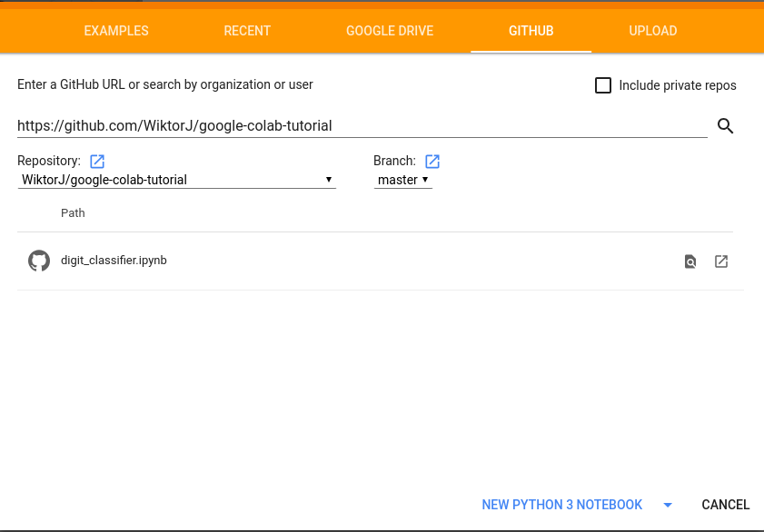
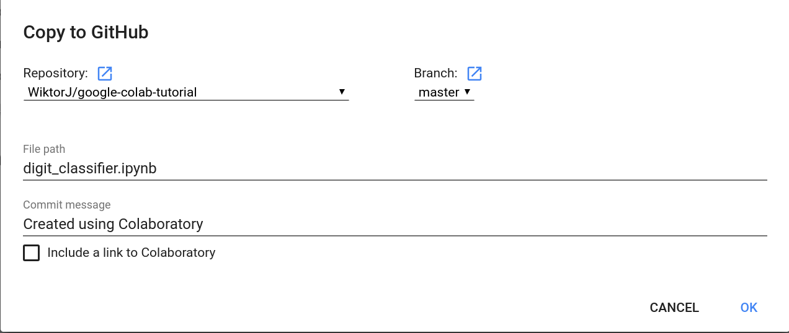

# Introduction
Basic tutorial on how to (relatively) conveniently use Google Colab with Google Drive and Github

### What is Colab
It’s a Jupyter notebook environment that requires no setup to use.
Moreover it gives you **free GPU** access to run your code.

In simple words Colab is a free hosted Jupyter notebook with access to GPU.

#### Important information
* Colab Runtime - Instance of Jupyter notebook. 
    ##### Security considerations
    Make sure you trust the authors of any notebook before executing it. 
    
    With a local connection, the code you execute can read, write, and delete files on your computer.
    Connecting to a Jupyter notebook server running on your local machine can provide many benefits. 
    With these benefits come serious potential risks. 
    By connecting to a local runtime, 
    you are allowing the Colaboratory frontend to execute code in the notebook using the local resources on your machine. 
    This means that the notebook could:
    * Invoke arbitrary commands (i.e. "rm -rf /")
    * Access the local file system
    * Run malicious content on your machine
    
    Before attempting to connect to a local runtime, make sure you trust the authors of the notebook and ensure you understand what code is being executed. For more information on the Jupyter notebook server's security model, consult Jupyter's documentation.

* Colab stores the notebooks in your Google Drive. 
    (Although limited integration with github is also possible, more on this in *Quick Start*)

* All the files uploaded to Colab are **ephemeral**, they are **gone** after reloading Colab Runtime.

    The recommended way is to upload your data to Google Drive then mount the drive in the Runtime (instructions in **Quick Start**)
    
* Colab provides integration with Github. It's possible to load notebooks directly from repositories 
and commit changes made in Colab. However, there are some limitations (more in **Quick Start**)

* This tutorial shows just one way of using Colab, everyone should adjust the flow accordingly.

##  Quick Start

1. Create Github repository and push Jupyter Notebook (can be empty) into it 
(if you already have a notebook that you want to run in colab in some other repository you can skip this step.)

2. Go to <https://colab.research.google.com/>, pick *GITHUB* source and put the repository details

    

3. Click on **NEW PYTHON 3 NOTEBOOK** and that's (almost) it! Now you can write and run your code in Colab using Google GPUs

### Bonus
#### Accessing data on Google Drive
Code below mounts your Google Drive to 
`/content/drive/My Drive` directory.

In case `google.cloab` is not found it assumes that the notebook runs somewhere else and it doesn't mount the drive.
```python
try:
    from google.colab import drive
    drive.mount("/content/drive/", force_remount=True)
    google_drive_prefix = "/content/drive/My Drive"
    data_prefix = "{}/mnist/".format(google_drive_prefix)
except ModuleNotFoundError: 
    data_prefix = "data/"
```

After that your data are available locally:
`f = gzip.open("{}/train-images-idx3-ubyte.gz".format(data_prefix), 'r')`

#### Integration with Github

It is more convenient to work on your code locally (e.g. Using JupyterLab or Pycharm) and use Colab only to
execute the code on GPU and do some small changes (e.g. Hyper parameters tuning).

Unfortunately there is no `git pull` functionality in Colab, so once you push a new changes into the Repository
you have to reopen your notebook (File -> Open notebook -> GITHUB -> Open notebook in new tab (Square with arrow next to the notebook name)).
The downside is that the runtime has to be reloaded.


##### Warning This might create conflicts! 
 
However, it's possible to push changes made in colab to the Repo (File -> Save a copy in Github):

This will make a commit to the Repository.

#### Using GPUs
**Warning** This will reload your runtime!

Navigate to: Runtime -> Change runtime type -> Hardware accelerator -> pick GPU (or TPU) 

